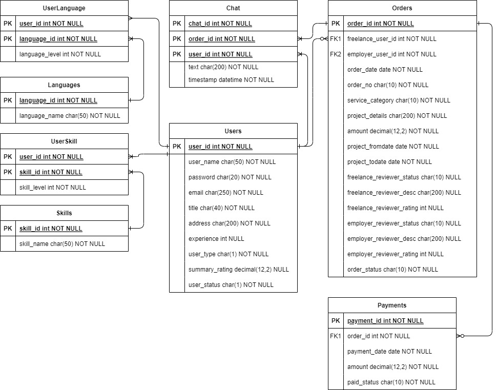

# DataBase Projects

This repository contains the comprehensive database design, It includes both 
1. The Freelance database schema.
2. Sencond project is backend design for a dashboard web application. Detailed information about each component is provided below.

## Freelance's Database Schema

The database schema is meticulously designed to manage various aspects of the freelance hiring process. It includes tables to handle users, skills, languages, orders, chats, and payments. This design ensures efficient data management and retrieval for a seamless user experience.

### Database Schema Design

### Key Components:
- **Users**: Manage user information and authentication.
- **Skills**: Catalog and manage skills offered by freelancers.
- **Languages**: Track languages spoken and understood by users.
- **Orders**: Handle order creation, tracking, and history.
- **Chats**: Manage communication between clients and freelancers.
- **Payments**: Process and track payments for services rendered.

## Dashboard-Web Backend
this is mini project about database project.
This section describes the backend development for a simple dashboard web application designed for administrative purposes. While the current implementation does not include a user interface (UX/UI), it is built using robust technologies to ensure functionality and scalability.

### Technologies Used:
- **JavaScript**: The primary programming language used for the application.
- **Node.js**: A runtime environment that allows JavaScript to be used on the server side.
- **Express**: A minimal and flexible Node.js web application framework for building the backend.
- **MongoDB**: A NoSQL database used for storing and managing data.

